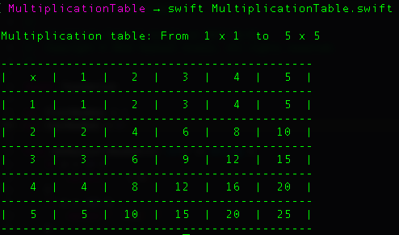

# MultiplicationTable
An example of how to implement a Multiplication Table in Swift 4.0

#### To test the Swift file, you can open your computer console and type
>$ swift MultiplicationTable.swift

#### Changing the table size
You can modify the values of the variables ```startsWith``` and ```endsWith```

#### Example of an **1 x 1  to  5 x 5** Multiplication Table

<p align="left">
  
</p>

